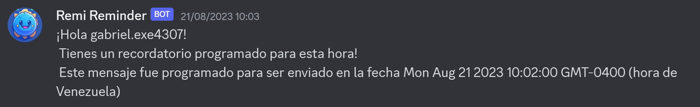

# REMINDER DISCORD BOT

Tired of forgetting your daily tasks? or missing an important date just like a friend birthday (or even your own), your anniversary, your dentist appointment, etc.

well well well, i got you.

I introduce you **Remi Reminder**, your new discord bot that will remind you every single task at the exact hour you provide to it. Useful for your discord server, even your friends can use it, it is really easy!


## Getting Started

To use Remi Reminder, follow these steps:

1. Create a user by using the `/create-user` command followed by your desired username. For example:

  

2. Once your user is created, you can create a reminder using the `/create-reminder` command. You can specify the time in a 24-hour format and include minutes, seconds, and a description. For example:

  

3. Your reminders will be saved in an SQLite3 database with a unique ID.

4. You can view all your reminders in a table format using the `/my-reminders` command.

  

5. If you want to delete a specific reminder, use the `/delete-reminder` command followed by the ID of the reminder you want to remove. For example:

  
  

6. To delete your user and all associated reminders, use the `/delete-user` command.

7. Make sure your Discord direct messages are enabled, as the bot will send you private messages to notify you when it's time for a reminder.

  


## Installation and Setup
Follow these steps to install and set up the Remi Reminder Discord bot on your server:

Step 1: Download Node.js
Ensure you have Node.js installed on your system. If you don't already have it, follow these steps:

Visit the Node.js website: https://nodejs.org/.
Download the LTS (Long Term Support) version of Node.js for your operating system.

Step 2: Download and Install Git.

Git is used to clone the Remi Reminder bot's repository from GitHub. Follow these steps to install Git:

### For Windows:

Download Git for Windows from https://gitforwindows.org/.
Run the downloaded installer and follow the instructions to install Git on your system.

### For Linux:

Open a terminal.
Depending on your Linux distribution, use your system's package manager to install Git. For example, on Ubuntu, you can use the following command:
``` Bash
sudo apt-get install git
```
Step 3: Clone the Repository.
Once you have Node.js and Git installed, clone the Remi Reminder bot's repository to your local system using these steps:

Open a terminal or command prompt.
Execute the following command to clone the Remi Reminder repository from GitHub:
```Bash
git clone git@github.com:GabrielCastroV/reminder-discord-bot.git
```
Step 4: Install Dependencies.
Inside the bot's directory (the directory you just cloned), run the following command to install the project's dependencies:

Remi Reminder relies on the following dependencies:

- `ascii-table3` for visual tables in Discord.
- `better-sqlite3` for the database.
- `date-fns` for date and time manipulation.
- `discord.js` for Discord integration.
- `dotenv` for environment variable management.
- `node-cron` for scheduling reminders.

Before using Remi Reminder, make sure to install the required dependencies using npm:

```bash
npm install
```
Step 5: Create a .env File and Configure Variables.
Before running the bot, create a `.env` file in the bot's directory and configure the necessary variables. Here's how to do it:

1. Navigate to the directory where you cloned the Remi Reminder bot.

2. Create a file named `.env` using a text editor or terminal commands.

3. Inside the .env file, add the following lines and replace the placeholder values with your own Discord Bot Token, Client ID, and Guild ID:

```
TOKEN=YOUR_DISCORD_BOT_TOKEN
CLIENT_ID=YOUR_DISCORD_CLIENT_ID
GUILD_ID=YOUR_DISCORD_GUILD_ID
```
Step 6: Obtain Bot ID and Token.
To use the bot on your Discord server, you'll need to create a Discord Bot account and obtain its ID and Token:

1. Visit the Discord Developer Portal at https://discord.com/developers/applications.
2. Click on "New Application" and give it a name (e.g., "Remi Reminder Bot").
3. In the left sidebar, click on "Bot," then click "Add Bot" to create a bot user.
4. Under the "Token" section, click "Copy" to copy the bot's token.
 
Step 7: Invite the Bot to Your Server.
To add the bot to your Discord server, use the following URL, replacing YOUR_CLIENT_ID with your bot's Client ID (found in the "General Information" section of your application in the Developer Portal):
``` Bash
https://discord.com/oauth2/authorize?client_id=YOUR_CLIENT_ID&scope=bot&permissions=114112
```
Step 8: Start the Bot
Once everything is configured, you can start the bot using the following command:
``` Bash
npm run dev
```
Your Remi Reminder bot should now be up and running on your Discord server, ready to help you manage your reminders!

If you have any questions or encounter any issues during installation, feel free to refer to the project's documentation or open an issue on the GitHub repository for additional assistance.

